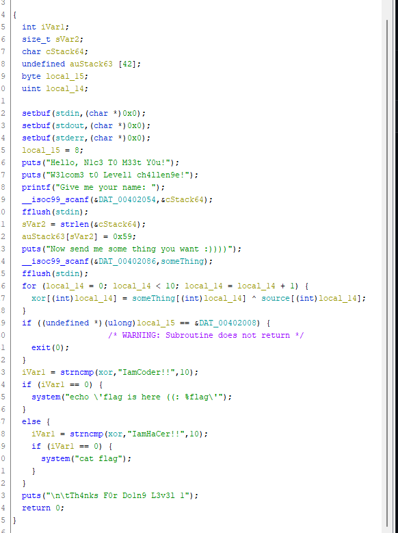
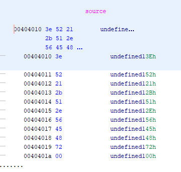

<h1>Write-Up PTITCTF 2023</h1>
# Level 1 pwn

- Đầu tiên chúng ta quăng file vào Ghidra để coi mã giả.

 

 

- Đọc code từ dưới lên thì ta thấy rằng để có được flag thì biến `xor` = `IamHaCer!!`
- Kéo tiếp lên trên thì ta thấy rằng biến `xor` chính là kết quả của phép xor giữa `something` (input thứ 2) và `source` (Data của chương trình)
- Ấn vào `source` để coi thử nó là gì ...

 

- Dịch hết mã đó qua ASCII thì chúng ta được đoạn text như sau `>R!+Q.VEHr`
- Như vậy chúng ta đã tìm được `source`. Bây giờ để tìm biến `something` thì chúng ta xor biến `source` với biến `xor`
 

