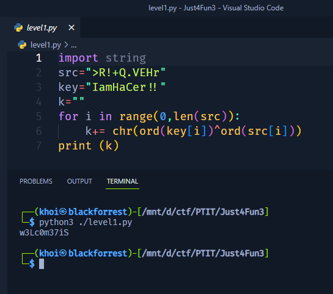
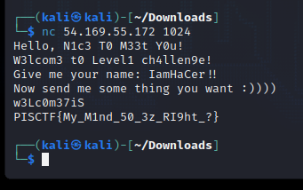
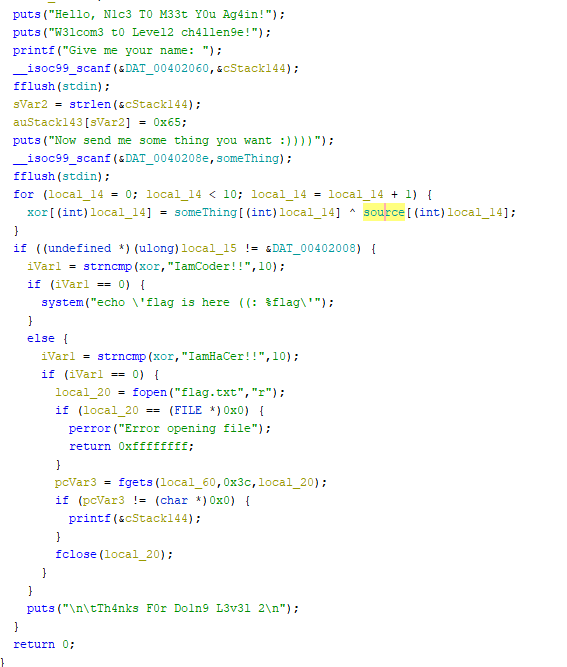
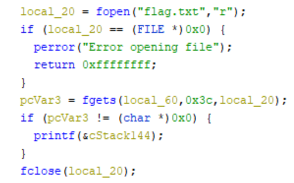
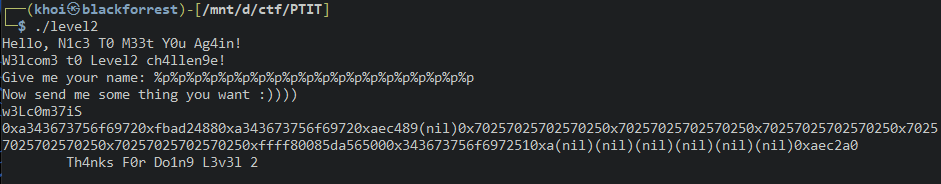

<h1>Write-Up PTITCTF 2023</h1>
<h3># Level 1 pwn</h3>

- Đầu tiên chúng ta quăng file vào Ghidra để coi mã giả.

 

 

- Đọc code từ dưới lên thì ta thấy rằng để có được flag thì biến `xor` = `IamHaCer!!`
- Kéo tiếp lên trên thì ta thấy rằng biến `xor` chính là kết quả của phép xor giữa `something` (input thứ 2) và `source` (Data của chương trình)
- Ấn vào `source` để coi thử nó là gì ...

 

- Dịch hết mã đó qua ASCII thì chúng ta được đoạn text như sau `>R!+Q.VEHr`
- Như vậy chúng ta đã tìm được `source`. Bây giờ để tìm biến `something` thì chúng ta xor biến `source` với biến `xor`
 

- Và chúng ta tìm được `w3Lc0m37iS`. Đến lúc test thử chương trình

 
- Submit flag thôi PISCTF{My_M1nd_50_3z_RI9ht_?}

<h3># Level 2 pwn</h3>

- Chúng ta quăng tiếp file vào Ghidra để đọc mã giả.
 

 

- Tập trung nhìn kĩ ta thấy dòng `printf(&cStack144)` => Lỗi format string thiếu `%s`.

 

 

- Để vào được vòng if ta lại phải so sánh biến `xor` và `IamHaCaer!!` để vào được vùng có flag (tương tự bài trên).
- `w3Lc0m37iS`.
- Thử chạy chường trình với input là %p.

 

 

- Sau 1 hồi vọc %p thì chúng ta có được đoạn hex như trên. 
- Dịch ra ASCII và không quên đảo ngược lại chữ và ta có được flag `PISCTF{W3ll_w311_Y0u_4re_4_BAD_b0y_0r_g1rL_<:}`
                                   
